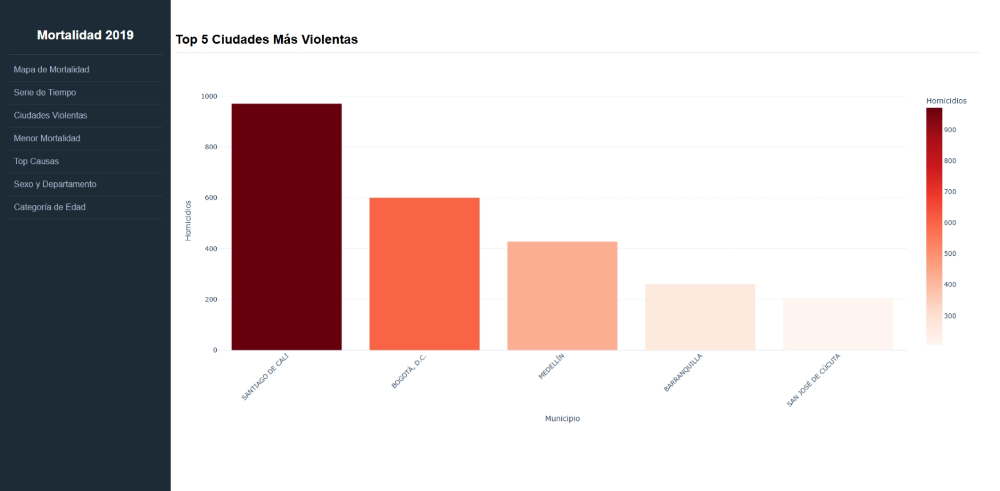
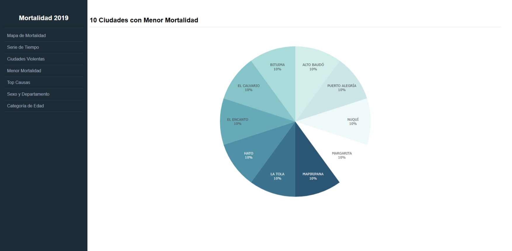
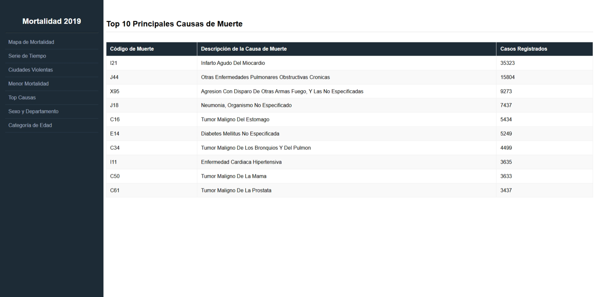

# Dashboard de Mortalidad 2019

## Introducción del proyecto

Este proyecto es una aplicación web interactiva desarrollada con Dash para explorar la mortalidad en Colombia durante 2019. La aplicación ofrece visualizaciones geográficas, temporales y de causa, permitiendo análisis intuitivos de los patrones de mortalidad en el país.

## Objetivo

El objetivo de la aplicación es analizar la distribución de muertes por departamento, identificar tendencias mensuales, encontrar las ciudades con más homicidios y menor mortalidad, comparar muertes por género y departamento, y mostrar las principales causas de muerte y la distribución por grupo de edad.

## Estructura del proyecto

- `src/` - Código fuente de la aplicación Dash.
  - `app.py` - Archivo principal que inicializa la aplicación y define el layout global.
  - `data_processing.py` - Carga y prepara los datos para las visualizaciones.
  - `figure_cache.py` - Construye y almacena en caché las figuras y tablas usadas en la interfaz.
  - `callbacks/router.py` - Controla la navegación entre rutas y páginas.
  - `components/sidebar.py` - Define el menú lateral de navegación.
  - `pages/views.py` - Define layouts reutilizables para cada página.
- `data/` - Contiene el dataset procesado en formato `parquet`.
  - `clean_mortality.parquet` - Dataset principal de mortalidad.
- `assets/` - Recursos estáticos usados por la aplicación.
  - `colombia.geojson` - Archivo GeoJSON con los límites geográficos de los departamentos.
- `requirements.txt` - Lista de dependencias necesarias para ejecutar la aplicación.
- `README.md` - Documento de instrucciones y descripción del proyecto.

## Requisitos

- Python 3.11+ (recomendado)
- dash==4.1.0
- pandas==3.0.2
- plotly==6.7.0
- pyarrow==24.0.0
- gunicorn==26.0.0

> Nota: la versión de Python puede variar según el entorno, pero se recomienda usar Python 3.11 o superior para compatibilidad con las dependencias actuales.

## Software utilizado

- Python
- Dash
- Plotly
- pandas
- pyarrow
- Gunicorn (para despliegue en producción)

## Instalación local

1. Clonar el repositorio:

```bash
git clone https://github.com/luisk9811/mortality_dashboard.git
cd mortality_dashboard
```

2. Crear y activar un entorno virtual:

```bash
python -m venv venv
venv\Scripts\Activate
```

3. Instalar dependencias:

```bash
pip install -r requirements.txt
```

4. Verificar que el archivo de datos exista en `data/clean_mortality.parquet` y que el archivo geoespacial exista en `assets/colombia.geojson`.

5. Ejecutar la aplicación:

```bash
python src/app.py
```

6. Abrir el navegador en `http://localhost:8080`.

## Despliegue en Render

Para desplegar en Render, sigue estos pasos generales:

1. Crear un nuevo servicio web en Render y conectar el repositorio.
2. Usar Python 3.11 o una versión compatible.
3. Configurar el comando de inicio (Start Command):

```bash
cd src && gunicorn app:server --bind 0.0.0.0:$PORT
```

4. Asegurarse de que los archivos `data/clean_mortality.parquet` y `assets/colombia.geojson` estén incluidos en el repositorio o disponibles en el entorno de despliegue.
5. Configurar `Build Command` si es necesario:

```bash
pip install -r requirements.txt
```

> Render detectará el puerto a través de la variable `$PORT`, y la aplicación debe exponerse usando el objeto `server` de Dash.

## Visualizaciones y hallazgos

### 1. Mapa de Mortalidad por Departamento

- Visualización: gráfico de coropletas que muestra el total de muertes por departamento.
- Hallazgo: permite identificar departamentos con mayor concentración de muertes y comparar regiones del país.


### 2. Serie de Tiempo de Muertes por Mes

- Visualización: línea temporal de muertes mensuales.
- Hallazgo: revela tendencias estacionales y posibles picos de mortalidad a lo largo del año.


### 3. Top 5 Ciudades Más Violentas

- Visualización: gráfico de barras con las ciudades donde se registraron más homicidios.
- Hallazgo: facilita detectar municipios con mayor violencia letal.



### 4. 10 Ciudades con Menor Mortalidad

- Visualización: gráfico de pastel con los municipios con menor número de muertes.
- Hallazgo: muestra qué localidades presentan menor impacto mortal en el dataset.



### 5. Top 10 Principales Causas de Muerte

- Visualización: tabla con las principales causas de muerte ordenadas por casos registrados.
- Hallazgo: identifica las causas más frecuentes, útil para priorizar intervenciones de salud pública.



### 6. Comparación por Sexo y Departamento

- Visualización: gráfico de barras apiladas que muestra muertes por género en cada departamento.
- Hallazgo: evidencia diferencias en mortalidad entre hombres y mujeres por región.


### 7. Distribución de Muertes por Categoría de Edad

- Visualización: gráfico de barras que muestra muertes por grupo de edad.
- Hallazgo: ayuda a ver qué segmentos etarios presentan mayor mortalidad.


## Notas adicionales

- La aplicación usa un menú lateral para navegar entre diferentes análisis.
- El dataset y el GeoJSON son necesarios para cargar las visualizaciones correctamente.
- Si faltan datos o archivos, la aplicación levantará un error indicando la ruta faltante.
