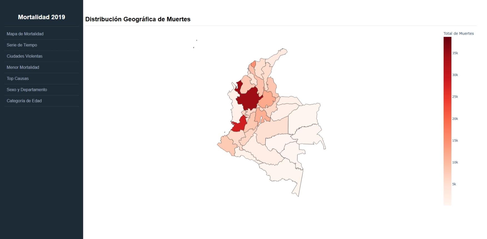
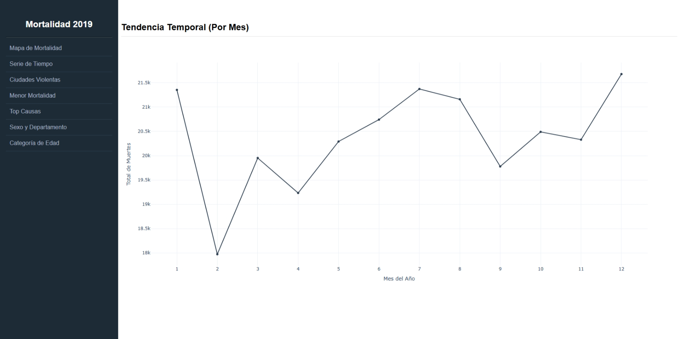
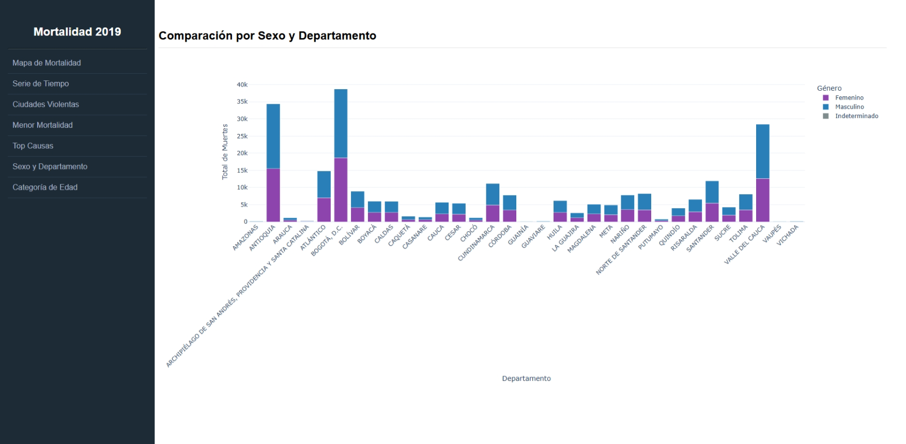
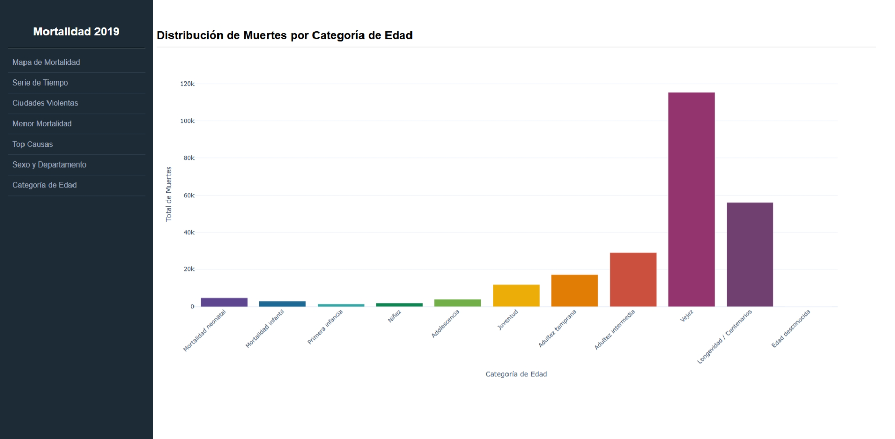

# Actividad 4: Aplicación web interactiva para el análisis de mortalidad en Colombia

## Universidad de La Salle  
### Maestría en Inteligencia Artificial

## Integrantes

- Luis Carlos Rodríguez Díaz
- Maydda Ginneth Rodríguez Fernández
- Yony Yu Cen

---

## Aplicación desplegada

La aplicación se encuentra disponible públicamente en Render:

https://mortality-dashboard-colombia.onrender.com/

---
---

# Dashboard de Mortalidad en Colombia - 2019

---

## Introducción del proyecto

Este proyecto consiste en el desarrollo de una aplicación web interactiva para el análisis de mortalidad en Colombia durante el año 2019, utilizando Python, Dash y Plotly.

La aplicación permite explorar de manera visual e intuitiva distintos patrones de mortalidad mediante gráficos interactivos, mapas geográficos y tablas dinámicas, facilitando el análisis de tendencias demográficas, regionales y epidemiológicas a partir de datos oficiales del DANE.

El dashboard fue desarrollado como parte de una actividad académica enfocada en análisis de datos, visualización interactiva y despliegue de aplicaciones web dinámicas en la nube.

---

## Objetivo

Desarrollar una aplicación web dinámica que permita analizar y visualizar datos de mortalidad en Colombia durante el año 2019, identificando:

- Distribución geográfica de muertes por departamento.
- Tendencias temporales de mortalidad.
- Ciudades con mayores índices de homicidios.
- Municipios con menor mortalidad.
- Principales causas de muerte.
- Diferencias de mortalidad por sexo y región.
- Distribución de mortalidad por grupos etarios.

La aplicación busca facilitar la interpretación de grandes volúmenes de datos mediante visualizaciones interactivas y accesibles.

---

## Características principales

- Dashboard interactivo desarrollado con Dash.
- Navegación dinámica mediante menú lateral.
- Visualizaciones avanzadas con Plotly.
- Mapa geográfico de mortalidad por departamento.
- Procesamiento y transformación de datos con pandas.
- Uso de formato parquet para mejorar rendimiento.
- Arquitectura modular y reutilizable.
- Preparado para despliegue en plataformas PaaS como Render.

---

## Arquitectura general

```text
Usuario
   │
   ▼
Aplicación Dash
   │
   ├── Procesamiento de datos (pandas)
   ├── Generación de visualizaciones (Plotly)
   ├── Navegación y callbacks (Dash)
   └── Renderizado web interactivo
```

---

## Estructura del proyecto

```text
mortality_dashboard/
│
├── src/
│   ├── app.py
│   ├── data_processing.py
│   ├── figure_cache.py
│   │
│   ├── callbacks/
│   │   └── router.py
│   │
│   ├── components/
│   │   └── sidebar.py
│   │
│   └── pages/
│       └── views.py
│
├── data/
│   └── clean_mortality.parquet
│
├── assets/
│   └── colombia.geojson
│
├── requirements.txt
└── README.md
```

### Descripción de archivos principales

| Archivo / Carpeta | Descripción |
|---|---|
| `app.py` | Punto de entrada principal de la aplicación Dash |
| `data_processing.py` | Procesamiento, limpieza y transformación de datos |
| `figure_cache.py` | Construcción y almacenamiento de figuras |
| `callbacks/router.py` | Manejo de navegación entre páginas |
| `components/sidebar.py` | Menú lateral de navegación |
| `pages/views.py` | Layouts y vistas del dashboard |
| `data/` | Dataset procesado |
| `assets/` | Recursos estáticos y archivos geográficos |

---

## Procesamiento de datos

Durante el desarrollo se realizaron diferentes tareas de preparación y transformación de datos utilizando `pandas`:

- Limpieza de registros inconsistentes.
- Agrupación de datos por departamento y municipio.
- Cálculo de totales de mortalidad.
- Clasificación por grupos etarios.
- Integración de información geográfica mediante GeoJSON.
- Conversión de archivos Excel a formato parquet para optimizar el rendimiento de carga.

---

## Requisitos

### Software requerido

- Python 3.11 o superior
- pip
- Git

### Librerías principales

- Dash
- Plotly
- pandas
- pyarrow
- gunicorn

---

## Instalación local

### 1. Clonar el repositorio

```bash
git clone https://github.com/luisk9811/mortality_dashboard.git
cd mortality_dashboard
```

---

### 2. Crear entorno virtual

#### Windows

```bash
python -m venv venv
venv\Scripts\activate
```

#### Linux / Mac

```bash
python3 -m venv venv
source venv/bin/activate
```

---

### 3. Instalar dependencias

```bash
pip install -r requirements.txt
```

---

### 4. Ejecutar la aplicación

```bash
python src/app.py
```

---

### 5. Abrir en el navegador

```text
http://localhost:8080
```

---

## Despliegue en Render

La aplicación fue preparada para ser desplegada en Render utilizando Gunicorn.

### Pasos realizados

1. Crear un nuevo servicio web en Render.
2. Conectar el repositorio de GitHub.
3. Configurar el entorno Python.
4. Instalar dependencias desde `requirements.txt`.
5. Configurar el comando de inicio.

### Start Command

```bash
cd src && gunicorn app:server --bind 0.0.0.0:$PORT
```

### Build Command

```bash
pip install -r requirements.txt
```

### Consideraciones

- El dataset parquet y el archivo GeoJSON deben estar incluidos en el repositorio.
- Render asigna automáticamente el puerto mediante la variable `$PORT`.
- La aplicación utiliza el objeto `server` de Dash para producción.

---

## Software utilizado

| Herramienta | Uso |
|---|---|
| Python | Lenguaje principal |
| Dash | Framework web interactivo |
| Plotly | Visualizaciones dinámicas |
| pandas | Procesamiento de datos |
| pyarrow | Manejo de archivos parquet |
| Gunicorn | Servidor WSGI para despliegue |
| Render | Plataforma de despliegue |

---

# Visualizaciones y análisis de resultados

---

## 1. Distribución Geográfica de Muertes

Esta visualización presenta un mapa coroplético de Colombia mostrando el total de muertes por departamento.

### Hallazgos

- Antioquia y Valle del Cauca presentan las mayores concentraciones de mortalidad.
- Los departamentos amazónicos y regiones menos pobladas muestran menores registros.
- Se evidencian diferencias regionales importantes en la distribución de mortalidad.



---

## 2. Tendencia Temporal de Muertes

Gráfico de líneas que representa el comportamiento mensual de las muertes durante el año 2019.

### Hallazgos

- Se observan variaciones moderadas a lo largo del año.
- Enero, Julio y diciembre presentan incrementos notorios en mortalidad.
- Febrero registra uno de los valores más bajos del periodo analizado.



---

## 3. Top 5 Ciudades Más Violentas

Gráfico de barras que muestra los municipios con mayor cantidad de homicidios registrados utilizando el código X95.

### Hallazgos

- Santiago de Cali registra el mayor número de homicidios.
- Bogotá D.C. y Medellín también presentan altos niveles de violencia letal.
- La visualización permite identificar focos urbanos críticos.


---

## 4. Municipios con Menor Mortalidad

Visualización de los municipios con menor cantidad de muertes registradas.

### Hallazgos

- Los municipios con menor mortalidad corresponden principalmente a poblaciones pequeñas o aisladas.
- Se observa una distribución homogénea entre las localidades analizadas.


---

## 5. Principales Causas de Muerte

Tabla interactiva con las causas de muerte más frecuentes registradas en Colombia durante 2019.

### Hallazgos

- El infarto agudo de miocardio representa la principal causa de muerte.
- Las enfermedades cardiovasculares y respiratorias predominan en los primeros lugares.
- Los homicidios aparecen entre las principales causas analizadas.


---

## 6. Comparación por Sexo y Departamento

Gráfico de barras apiladas que compara la mortalidad por género en cada departamento.

### Hallazgos

- En la mayoría de departamentos se registra mayor mortalidad masculina.
- Bogotá D.C., Antioquia y Valle del Cauca presentan los valores más altos para ambos sexos.
- Las diferencias de mortalidad entre géneros son visibles en varias regiones.



---

## 7. Distribución por Categoría de Edad

Visualización de mortalidad agrupada por categorías etarias.

### Hallazgos

- La categoría de vejez concentra la mayor cantidad de muertes.
- La mortalidad aumenta considerablemente a partir de la adultez intermedia.
- Las categorías infantiles presentan menor incidencia relativa.



---

## Fuentes de datos

Los datos utilizados provienen de:

- Departamento Administrativo Nacional de Estadística (DANE)
- Estadísticas Vitales - EEVV 2019

Archivos utilizados:

- NoFetal2019.xlsx
- CodigosDeMuerte.xlsx
- Divipola.xlsx

---

## Conclusiones

El análisis permitió identificar patrones importantes de mortalidad en Colombia durante 2019, evidenciando diferencias regionales, variaciones temporales y cambios significativos según sexo y grupo etario.

La implementación del dashboard utilizando Dash y Plotly facilitó la construcción de una herramienta interactiva capaz de transformar datos complejos en visualizaciones intuitivas y comprensibles.

Además, el proyecto fortaleció competencias relacionadas con:

- análisis de datos,
- visualización interactiva,
- desarrollo web con Python,
- procesamiento de información,
- y despliegue de aplicaciones en la nube.
